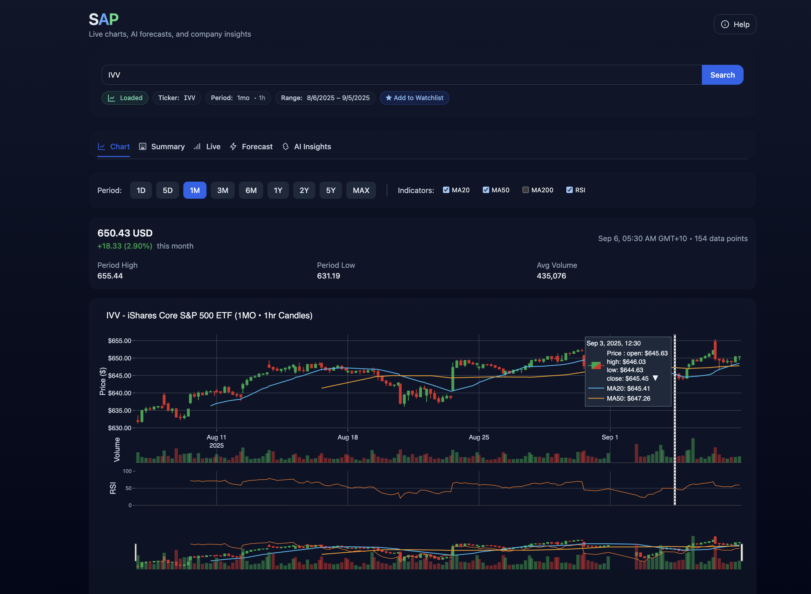

# stock-analysis-platform

A Next.js + FastAPI web application for exploring market data, company information, and running basic AI time-series predictions and LLM based sentiment analysis.



## Core Features
- Live candlestick chart with WebSocket streaming during market hours
- Historical OHLCV charts with indicator overlays
- Company summary with fundamentals, dividends/splits, and upcoming events
- Time-series prediction models and LLM integration for sentiment analysis
- Local caching (SQLite) and React Query persistence
  
## Architecture

```
├── backend/                   # FastAPI backend
│   ├── src/
│   │   ├── app/              # App, routers, middleware, schemas
│   │   ├── services/         # Cache service, data processing helpers
│   │   ├── database/         # SQLAlchemy models (DB auto-recreated on startup)
│   │   ├── data/             # yfinance loaders (ticker/info/history)
│   │   ├── models/           # Chronos‑Bolt predictors
│   │   ├── llm/              # LLM client & sentiment analyzer
│   │   └── config/           # Configuration settings
│   ├── pyproject.toml        # Python dependencies
├── frontend/                 # Next.js frontend
│   ├── app/                  # App router
│   ├── components/           # ChartPanel, LiveChart, Summary, Sentiment
│   ├── hooks/                # Data fetching, theme, chart manager
│   ├── utils/                # ChartManager, helpers
│   └── package.json
├── Makefile                  # Dev commands
└── README.md
```

## Tech Stack

Backend
- FastAPI, Uvicorn
- SQLAlchemy, SQLite (schema auto-recreated on startup)
- yfinance for market data
- technicalindicators for RSI, SMA calculations
- chronos‑forecasting (Chronos‑Bolt time-series predictors)
- OpenRouter LLM integration for sentiment analysis and chat functionality

Frontend
- Next.js, React, TypeScript
- Tailwind CSS with next-themes for dark mode
- Plotly.js for interactive charts
- @tanstack/react‑query (+ persist) for data caching

## Installation (Quickstart)

Prerequisites
- Python 3.10+
- Node.js 18+

**Optional**: Create a conda environment for Python dependencies:
```bash
conda create -n stock-analysis python=3.10
conda activate stock-analysis
```

Backend
```bash
# From repo root
make install
cp .env.example .env
# Edit .env if needed (APP_NAME, DATABASE_URL, LLM_PROVIDER, NEWS_API_KEY)
```

Frontend
```bash
cd frontend
npm install
cp .env.local.example .env.local
# Edit .env.local if needed (NEXT_PUBLIC_API_BASE_URL)
```

Run
```bash
# Terminal 1
make api  # http://localhost:8000

# Terminal 2
make web  # http://localhost:3000
```

## Configuration

Backend (.env)
```bash
APP_NAME=stock-analysis-platform
ENV=dev
LOG_LEVEL=INFO
DATABASE_URL=sqlite:///stock-analysis-platform.db
LLM_PROVIDER=mock
# LLM_PROVIDER=openrouter
# OPENROUTER_API_KEY=sk-or-v1-your-key-here
# News headlines (optional)
# Get a key from https://newsapi.org to enable richer company + macro headlines
# Without this, only company headlines via yfinance are used
# NEWS_API_KEY=your_newsapi_key_here
CORS_ALLOWED_ORIGINS=http://localhost:3000
```

Frontend (.env.local)
```bash
NEXT_PUBLIC_API_BASE_URL=http://localhost:8000
NEXT_PUBLIC_WS_BASE_URL=ws://localhost:8000
```

## API Endpoints

```text
GET  /health
GET  /financial/ticker/{symbol}
GET  /financial/history/{symbol}?period=1d|5d|1mo|…
GET  /financial/summary/{symbol}?extended=false|true
GET  /financial/models
POST /financial/predict
GET  /financial/sentiment/{symbol}
WS   /ws/{symbol}
```

## News Headlines (optional)
- If `NEWS_API_KEY` is set in `.env`, the backend uses NewsAPI to fetch:
  - Company headlines (targeted by company name)
  - Market/Macro headlines (broad market/economy context)
- If not set, the backend falls back to yfinance for company headlines only.
- Headlines are included in the analysis prompt and rendered in the UI.
